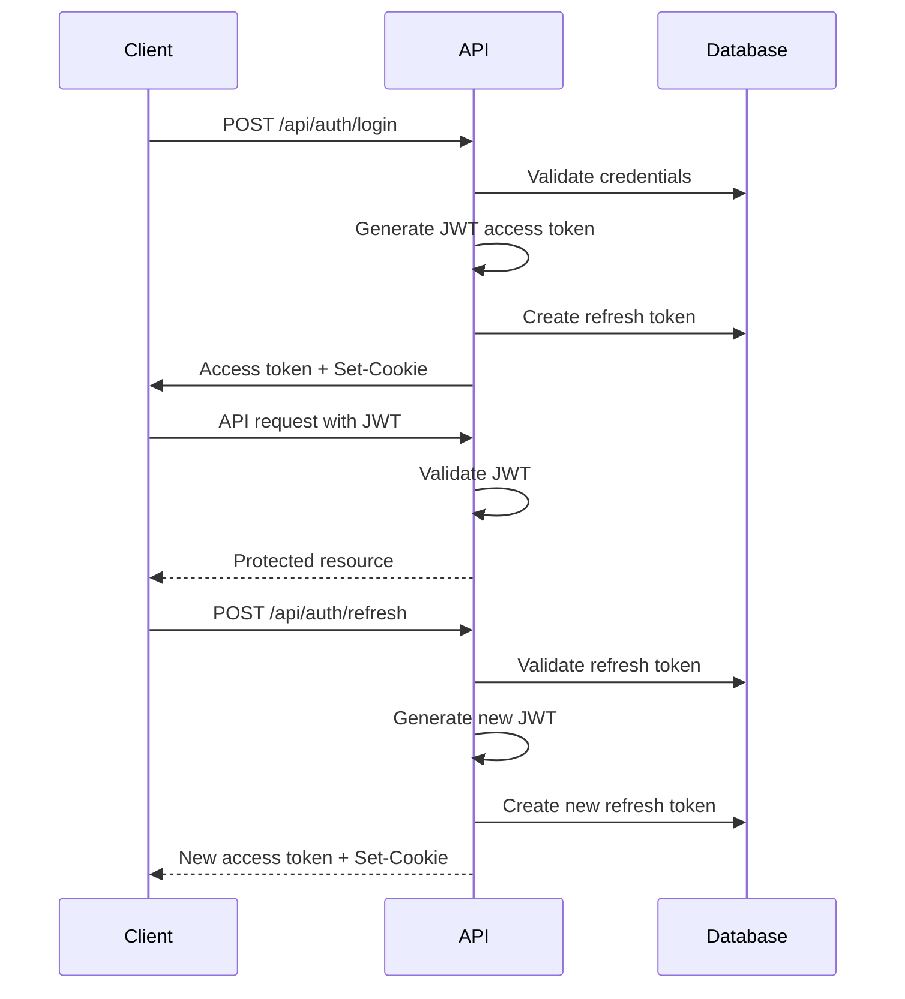
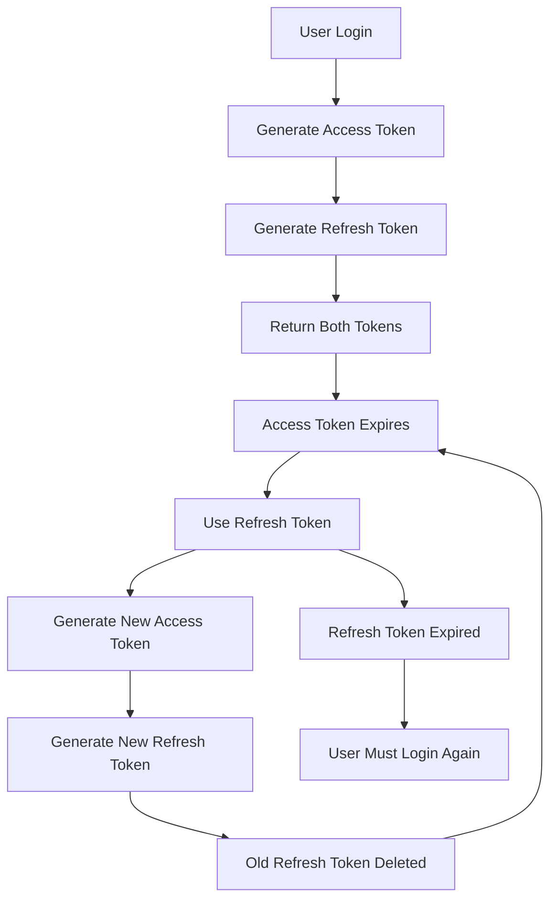

## Overview

Brautcloud uses a dual-token authentication system with JWT access tokens for API requests and long-lived refresh tokens stored in secure HTTP-only cookies. This provides a balance between security and user experience.

## Authentication Flow



## User Registration

### API Endpoint

```java AuthController.java:47-59
@PostMapping("/register")
public ResponseEntity<String> register(@RequestBody AuthRequest request) {
    if (userRepository.findByEmail(request.email()).isPresent()) {
        return ResponseEntity.badRequest().body("Email already used!");
    }
    
    User user = new User();
    user.setEmail(request.email());
    user.setPassword(passwordEncoder.encode(request.password()));
    userRepository.save(user);
    
    return ResponseEntity.ok("User registered successfully");
}
```

### Request Format

```java AuthRequest.java:3-4
public record AuthRequest(String email, String password) {}
```

### Security Features

- **Password Hashing**: Uses Spring Security's `PasswordEncoder` (typically BCrypt)
- **Email Uniqueness**: Validates that email addresses are unique before registration
- **Validation**: Returns 400 Bad Request if email already exists

<Note>
Passwords are automatically hashed using BCrypt before being stored in the database.
</Note>

## User Login

### API Endpoint

```java AuthController.java:61-83
@PostMapping("/login")
public ResponseEntity<AuthResponse> login(
    @RequestBody AuthRequest request,
    HttpServletResponse response
) {
    authenticationManager.authenticate(
        new UsernamePasswordAuthenticationToken(
            request.email(),
            request.password()
        )
    );
    
    User user = userRepository.findByEmail(request.email())
        .orElseThrow(() -> new UsernameNotFoundException("User not found"));
    
    String accessToken = jwtService.generateToken(request.email());
    RefreshToken refreshToken = refreshTokenService.createRefreshToken(user);
    
    ResponseCookie cookie = ResponseCookie.from("refresh_token", refreshToken.getToken())
        .httpOnly(true)
        .secure(false)
        .sameSite("Strict")
        .path("/api/auth")
        .maxAge(Duration.ofDays(30))
        .build();
    
    response.addHeader(HttpHeaders.SET_COOKIE, cookie.toString());
    
    return ResponseEntity.ok(new AuthResponse(accessToken));
}
```

### Login Process

<Steps>
  <Step title="Authenticate Credentials">
    Spring Security's `AuthenticationManager` validates email and password
  </Step>
  <Step title="Generate Access Token">
    A JWT access token is created with the user's email as the subject
  </Step>
  <Step title="Create Refresh Token">
    A UUID-based refresh token is generated and stored in the database
  </Step>
  <Step title="Set Cookie">
    The refresh token is sent as an HTTP-only cookie for security
  </Step>
  <Step title="Return Response">
    The access token is returned in the response body
  </Step>
</Steps>

## JWT Access Tokens

Access tokens are short-lived JWTs used for API authentication:

### Token Generation

```java JwtService.java:26-33
public String generateToken(String email) {
    return Jwts.builder()
        .subject(email)
        .issuedAt(new Date())
        .expiration(new Date(System.currentTimeMillis() + expiration))
        .signWith(getSigningKey())
        .compact();
}
```

### Token Validation

```java JwtService.java:39-42
public boolean isTokenValid(String token, UserDetails userDetails) {
    final String email = extractEmail(token);
    return email.equals(userDetails.getUsername()) && !isTokenExpired(token);
}
```

### Token Extraction

```java JwtService.java:35-37
public String extractEmail(String token) {
    return Jwts.parser()
        .verifyWith(getSigningKey())
        .build()
        .parseSignedClaims(token)
        .getPayload()
        .getSubject();
}
```

### Configuration

JWT settings are configured via application properties:

```properties
jwt.token.secret=your-secret-key-at-least-256-bits
jwt.token.expires=3600000  # 1 hour in milliseconds
```

<Warning>
The JWT secret must be at least 256 bits (32 characters) for HS256 algorithm security.
</Warning>

## Refresh Tokens

Refresh tokens are long-lived tokens stored in the database:

### Token Creation

```java RefreshTokenService.java:30-39
public RefreshToken createRefreshToken(User user) {
    refreshTokenRepository.deleteByUser(user);
    
    RefreshToken token = new RefreshToken();
    token.setUser(user);
    token.setToken(UUID.randomUUID().toString());
    token.setExpiresAt(Instant.now().plus(refreshExpiration));
    
    return refreshTokenRepository.save(token);
}
```

### Token Validation

```java RefreshTokenService.java:41-51
public RefreshToken validateRefreshToken(String token) {
    RefreshToken refreshToken = refreshTokenRepository.findByToken(token)
        .orElseThrow(() -> new InvalidRefreshTokenException("Refresh token not found"));
    
    if (refreshToken.getExpiresAt().isBefore(Instant.now())) {
        refreshTokenRepository.delete(refreshToken);
        throw new InvalidRefreshTokenException("Refresh token expired");
    }
    
    return refreshToken;
}
```

### Token Rotation

Each time a refresh token is used, it's replaced with a new one:

```java AuthController.java:85-105
@PostMapping("/refresh")
public ResponseEntity<AuthResponse> refresh(
    @CookieValue(name = "refresh_token") String refreshToken,
    HttpServletResponse response
) {
    RefreshToken existing = refreshTokenService.validateRefreshToken(refreshToken);
    
    String newAccessToken = jwtService.generateToken(existing.getUser().getEmail());
    
    RefreshToken newRefreshToken = refreshTokenService.createRefreshToken(existing.getUser());
    
    ResponseCookie cookie = ResponseCookie.from("refresh_token", newRefreshToken.getToken())
        .httpOnly(true)
        .secure(false)
        .sameSite("Strict")
        .path("/api/auth")
        .maxAge(Duration.ofDays(30))
        .build();
    
    response.addHeader(HttpHeaders.SET_COOKIE, cookie.toString());
    return ResponseEntity.ok(new AuthResponse(newAccessToken));
}
```

<Note>
Token rotation improves security by limiting the lifetime of each refresh token, even if the expiration is 30 days.
</Note>

## Secure Cookie Handling

Refresh tokens are stored in HTTP-only cookies with security settings:

### Cookie Configuration

- **httpOnly**: `true` - Prevents JavaScript access to the cookie
- **secure**: `false` (development) - Set to `true` in production for HTTPS-only
- **sameSite**: `Strict` - Prevents CSRF attacks
- **path**: `/api/auth` - Limits cookie scope to auth endpoints
- **maxAge**: 30 days - Long-lived for better UX

```java
ResponseCookie cookie = ResponseCookie.from("refresh_token", tokenValue)
    .httpOnly(true)
    .secure(false)  // Set to true in production
    .sameSite("Strict")
    .path("/api/auth")
    .maxAge(Duration.ofDays(30))
    .build();
```

<Warning>
Always set `secure: true` in production to ensure cookies are only sent over HTTPS.
</Warning>

## User Logout

Logout invalidates the refresh token and clears the cookie:

```java AuthController.java:107-128
@PostMapping("/logout")
public ResponseEntity<String> logout(
    @CookieValue(name = "refresh_token", required = false) String refreshToken,
    HttpServletResponse response
) {
    // Invalidate the refresh token in the DB if it exists
    if (refreshToken != null) {
        refreshTokenService.deleteByToken(refreshToken);
    }
    
    // Clear the cookie by setting maxAge to 0
    ResponseCookie cookie = ResponseCookie.from("refresh_token", "")
        .httpOnly(true)
        .secure(false) // true in production
        .sameSite("Strict")
        .path("/api/auth")
        .maxAge(0)
        .build();
    
    response.addHeader(HttpHeaders.SET_COOKIE, cookie.toString());
    
    return ResponseEntity.ok("Logged out");
}
```

### Logout Process

<Steps>
  <Step title="Delete Token from Database">
    The refresh token is removed from the database
  </Step>
  <Step title="Clear Cookie">
    A new cookie with `maxAge=0` is sent to clear the browser cookie
  </Step>
  <Step title="Client-Side Cleanup">
    The client should also discard the access token
  </Step>
</Steps>

## Security Best Practices

<AccordionGroup>
  <Accordion title="Token Storage">
    - Store access tokens in memory (not localStorage)
    - Refresh tokens are automatically stored in HTTP-only cookies
    - Never expose tokens in URLs or logs
  </Accordion>
  
  <Accordion title="Production Configuration">
    Update your production settings:
    
    ```properties
    # Use environment variables
    jwt.token.secret=${JWT_SECRET}
    jwt.token.expires=900000  # 15 minutes
    jwt.token.refreshExpires=2592000000  # 30 days
    ```
    
    Set cookie `secure: true` in production code.
  </Accordion>
  
  <Accordion title="Password Requirements">
    Add password validation in your registration endpoint:
    
    ```java
    if (request.password().length() < 8) {
        return ResponseEntity.badRequest()
            .body("Password must be at least 8 characters");
    }
    ```
  </Accordion>
  
  <Accordion title="Rate Limiting">
    Consider adding rate limiting to auth endpoints to prevent brute force attacks:
    
    - Limit login attempts per IP
    - Add exponential backoff for failed attempts
    - Consider using Spring Security's built-in rate limiting
  </Accordion>
</AccordionGroup>

## Token Lifecycle



## Related Features

<CardGroup cols={2}>
  <Card title="Guest Access" icon="users" href="/features/guest-access">
    Learn how guests access events without full authentication
  </Card>
  <Card title="Event Management" icon="calendar" href="/features/event-management">
    Understand how authenticated users create events
  </Card>
</CardGroup>