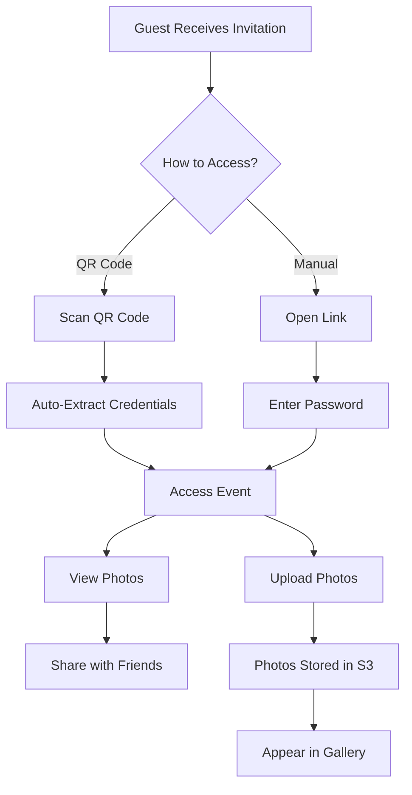

## Overview

Guests can access wedding events to view and upload photos without creating a full user account. The system uses a combination of QR codes for convenience and passwords for security.

## Access Methods

Brautcloud provides two ways for guests to access events:

<CardGroup cols={2}>
  <Card title="QR Code Scanning" icon="qrcode">
    Scan a QR code to quickly access an event without manual entry
  </Card>
  <Card title="Password Entry" icon="lock">
    Enter an event-specific password for manual access
  </Card>
</CardGroup>

## QR Code Access

### How It Works

Each event includes a QR code that encodes access information:

```java Event.java:30
private String qrCode;
```

The QR code is generated and stored when the event is created:

```java EventService.java:37
event.setQrCode(request.getQrCode());
```

### QR Code Content

The QR code should encode the following information:

```json
{
  "eventId": 123,
  "password": "wedding2024",
  "type": "brautcloud-event"
}
```

<Tip>
Encode both the event ID and password in the QR code to enable one-tap access for guests.
</Tip>

### Guest Flow with QR Code

<Steps>
  <Step title="Receive QR Code">
    Couple shares the QR code via wedding invitations, table cards, or digital channels
  </Step>
  <Step title="Scan QR Code">
    Guest scans the QR code using their phone's camera or the Brautcloud app
  </Step>
  <Step title="Auto-Authentication">
    App extracts event ID and password from the QR code
  </Step>
  <Step title="Access Event">
    Guest is immediately taken to the event's photo gallery and upload screen
  </Step>
</Steps>

### Implementation Example

Client-side QR code handling:

```javascript
// When QR code is scanned
function handleQRCodeScan(qrData) {
  try {
    const eventInfo = JSON.parse(qrData);
    
    // Validate it's a Brautcloud event
    if (eventInfo.type === 'brautcloud-event') {
      // Store credentials temporarily
      sessionStorage.setItem('guestEventId', eventInfo.eventId);
      sessionStorage.setItem('guestPassword', eventInfo.password);
      
      // Navigate to event
      window.location.href = `/guest/event/${eventInfo.eventId}`;
    }
  } catch (error) {
    console.error('Invalid QR code', error);
  }
}
```

## Password Protection

Events are protected by passwords that guests must provide:

```java Event.java:28
private String password;
```

### Password Validation

While the current backend doesn't expose a dedicated guest authentication endpoint, you can implement one:

```java
@PostMapping("/api/events/validate")
public ResponseEntity<EventResponse> validateGuestAccess(
    @RequestParam Long eventId,
    @RequestParam String password
) {
    Event event = eventRepository.findById(eventId)
        .orElseThrow(() -> new RuntimeException("Event not found"));
    
    if (!event.getPassword().equals(password)) {
        return ResponseEntity.status(HttpStatus.UNAUTHORIZED)
            .body(null);
    }
    
    return ResponseEntity.ok(EventResponse.fromEvent(event));
}
```

<Warning>
This example uses plain-text password comparison. Consider implementing password hashing for production use.
</Warning>

### Manual Access Flow

<Steps>
  <Step title="Enter Event ID">
    Guest enters the event ID or navigates to a shareable link
  </Step>
  <Step title="Enter Password">
    Guest is prompted to enter the event password
  </Step>
  <Step title="Validate Credentials">
    System validates the password against the stored event password
  </Step>
  <Step title="Grant Access">
    Guest can view and upload photos for the event
  </Step>
</Steps>

## Guest Workflows

### Viewing Photos

Guests can view all visible photos for an event:

```java ImageController.java:35-38
@GetMapping("{eventID}")
public List<ImageResponse> getAllImagesByEventID(@PathVariable Long eventID) {
    return imageService.getAllImagesByEventID(eventID);
}
```

This returns all images where `isVisible = true`:

```java ImageService.java:59-61
public List<ImageResponse> getAllImagesByEventID(Long eventID) {
    return imageRepository.findByEventId(eventID)
        .stream()
        .map(ImageResponse::fromImage)
        .toList();
}
```

### Uploading Photos

Guests can upload photos to the event:

```java ImageController.java:27-33
@PostMapping(consumes = MediaType.MULTIPART_FORM_DATA_VALUE)
public ResponseEntity<String> uploadFile(
    @RequestPart("file") MultipartFile file,
    @RequestPart("eventId") String eventId
) {
    ImageRequest request = new ImageRequest(Long.parseLong(eventId), file);
    return imageService.createNewImage(request);
}
```

<Note>
Guest uploads don't require full user authentication - they only need valid event access (event ID + password).
</Note>

## Guest Session Management

Implement client-side session management for guest access:

```javascript
class GuestSession {
  constructor(eventId, password) {
    this.eventId = eventId;
    this.password = password;
    this.sessionStartTime = Date.now();
  }
  
  // Store in session storage (cleared on browser close)
  save() {
    sessionStorage.setItem('guestSession', JSON.stringify({
      eventId: this.eventId,
      password: this.password,
      sessionStartTime: this.sessionStartTime
    }));
  }
  
  // Retrieve existing session
  static load() {
    const data = sessionStorage.getItem('guestSession');
    if (!data) return null;
    
    const session = JSON.parse(data);
    
    // Optional: Expire session after 24 hours
    const hoursSinceStart = (Date.now() - session.sessionStartTime) / (1000 * 60 * 60);
    if (hoursSinceStart > 24) {
      sessionStorage.removeItem('guestSession');
      return null;
    }
    
    return session;
  }
  
  // Clear session
  static clear() {
    sessionStorage.removeItem('guestSession');
  }
}
```

## Security Considerations

<AccordionGroup>
  <Accordion title="Password Security">
    Current implementation stores passwords in plain text. For production:
    
    ```java
    // When creating event
    event.setPassword(passwordEncoder.encode(request.getPassword()));
    
    // When validating
    if (!passwordEncoder.matches(providedPassword, event.getPassword())) {
        return ResponseEntity.status(HttpStatus.UNAUTHORIZED).build();
    }
    ```
  </Accordion>
  
  <Accordion title="Rate Limiting">
    Prevent brute force attacks on event passwords:
    
    - Limit password attempts per IP address
    - Add delays after failed attempts
    - Lock access after multiple failures
  </Accordion>
  
  <Accordion title="QR Code Security">
    - Generate unique QR codes for each event
    - Consider time-limited QR codes for sensitive events
    - Don't expose QR code URLs publicly
  </Accordion>
  
  <Accordion title="Content Moderation">
    Use the `isVisible` flag to moderate guest uploads:
    
    ```java
    // Default: visible
    image.setVisible(true);
    
    // Event owner can hide inappropriate content
    image.setVisible(false);
    ```
  </Accordion>
</AccordionGroup>

## Guest Experience Flow



## Best Practices

<Card title="Easy Sharing" icon="share-nodes">
  Make it easy for couples to share event access:
  
  - Generate shareable links: `brautcloud.com/event/123?password=wedding2024`
  - Provide downloadable QR codes for printing
  - Create social media-friendly share images with QR codes
  - Send automated invitations via email or SMS
</Card>

<Card title="Guest Instructions" icon="book-open">
  Provide clear instructions for guests:
  
  - Simple landing page explaining how to access
  - Visual guides for QR code scanning
  - Troubleshooting tips for common issues
  - Contact information for support
</Card>

<Card title="Privacy Settings" icon="shield">
  Give couples control over guest access:
  
  - Option to disable new uploads after the event
  - Ability to make event private (no new guest access)
  - Download all photos before closing access
  - Notification when guests upload photos
</Card>

## Implementing Guest Authentication Middleware

Create middleware to validate guest access on protected endpoints:

```java
@Component
public class GuestAccessFilter extends OncePerRequestFilter {
    
    @Override
    protected void doFilterInternal(
        HttpServletRequest request,
        HttpServletResponse response,
        FilterChain filterChain
    ) throws ServletException, IOException {
        
        // Check if this is a guest endpoint
        if (request.getRequestURI().startsWith("/api/guest/")) {
            String eventId = request.getParameter("eventId");
            String password = request.getParameter("password");
            
            if (eventId == null || password == null) {
                response.setStatus(HttpStatus.UNAUTHORIZED.value());
                return;
            }
            
            // Validate event access
            Event event = eventRepository.findById(Long.parseLong(eventId))
                .orElse(null);
            
            if (event == null || !event.getPassword().equals(password)) {
                response.setStatus(HttpStatus.UNAUTHORIZED.value());
                return;
            }
            
            // Set event in request context
            request.setAttribute("guestEvent", event);
        }
        
        filterChain.doFilter(request, response);
    }
}
```

## Related Features

<CardGroup cols={2}>
  <Card title="Event Management" icon="calendar" href="/features/event-management">
    Learn how events are created with QR codes and passwords
  </Card>
  <Card title="Image Sharing" icon="image" href="/features/image-sharing">
    Understand how guests upload photos to events
  </Card>
  <Card title="Authentication" icon="shield" href="/features/authentication">
    See the full authentication system for event owners
  </Card>
</CardGroup>