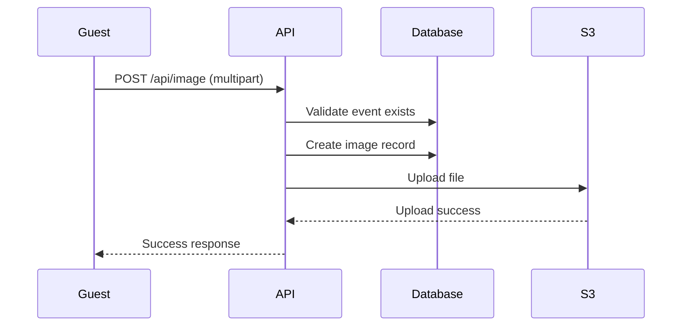

## Overview

Brautcloud's image sharing system allows guests to upload photos to wedding events, with automatic storage in AWS S3 (or compatible services like AiStore). Images are linked to specific events and include visibility controls for content moderation.

## Image Model

Images are stored in the database with references to S3:

```java Image.java:8-28
@Entity
@Table(name = "images")
public class Image {
    @Id
    @GeneratedValue(strategy = GenerationType.IDENTITY)
    private Long id;
    
    @ManyToOne
    @JoinColumn(name = "event_id")
    private Event event;
    
    private String imageKey;
    private boolean isVisible;
    
    @Column(insertable = false, updatable = false)
    private LocalDateTime createdAt;
}
```

### Key Fields

- **imageKey**: The S3 object key (filename) for retrieving the image
- **isVisible**: Boolean flag for content moderation (default: `true`)
- **event**: Reference to the parent event
- **createdAt**: Automatic timestamp for when the image was uploaded

## Uploading Images

### API Endpoint

Images are uploaded via multipart form data:

```java ImageController.java:27-33
@PostMapping(consumes = MediaType.MULTIPART_FORM_DATA_VALUE)
public ResponseEntity<String> uploadFile(
    @RequestPart("file") MultipartFile file,
    @RequestPart("eventId") String eventId
) {
    ImageRequest request = new ImageRequest(Long.parseLong(eventId), file);
    return imageService.createNewImage(request);
}
```

### Upload Workflow

The `ImageService` handles both database and S3 operations:

```java ImageService.java:48-57
public ResponseEntity<String> createNewImage(ImageRequest request) {
    Event event = eventRepository.findById(request.getEventId())
        .orElseThrow(() -> new RuntimeException("Event not found"));
    Image image = new Image();
    image.setVisible(true);
    image.setImageKey(request.getFile().getOriginalFilename());
    image.setEvent(event);
    imageRepository.save(image);
    return uploadFile(request.getFile());
}
```

### S3 Upload Implementation

The private `uploadFile` method handles the actual S3 transfer:

```java ImageService.java:34-46
private ResponseEntity<String> uploadFile(MultipartFile file) {
    try {
        File tempFile = File.createTempFile("upload-", file.getOriginalFilename());
        file.transferTo(tempFile);
        
        s3Service.uploadFile(file.getOriginalFilename(), tempFile);
        
        return ResponseEntity.ok("File uploaded successfully");
    } catch (Exception e) {
        return ResponseEntity.status(500)
            .body("Upload failed: " + e.getMessage());
    }
}
```

<Steps>
  <Step title="Create Temporary File">
    The multipart file is saved to a temporary local file
  </Step>
  <Step title="Upload to S3">
    The S3Service uploads the file using the AWS SDK
  </Step>
  <Step title="Save Metadata">
    Image metadata is saved to the database with the S3 key
  </Step>
</Steps>

## S3 Service Integration

The `S3Service` provides a thin wrapper around the AWS SDK:

```java S3Service.java:13-26
@Service
public class S3Service {
    @Autowired
    private S3Client s3Client;
    
    @Value("${aws.s3.bucket}")
    private String bucketName;
    
    public void uploadFile(String key, File file) {
        PutObjectRequest request = PutObjectRequest.builder()
            .bucket(bucketName)
            .key(key)
            .build();
        
        s3Client.putObject(request, file.toPath());
    }
}
```

### Configuration

The S3 bucket name is configured via application properties:

```properties
aws.s3.bucket=your-bucket-name
```

<Note>
The S3Service works with any S3-compatible storage service, including AiStore, MinIO, or AWS S3.
</Note>

## Retrieving Images

Get all images for a specific event:

```java ImageController.java:35-38
@GetMapping("{eventID}")
public List<ImageResponse> getAllImagesByEventID(@PathVariable Long eventID) {
    return imageService.getAllImagesByEventID(eventID);
}
```

Service implementation:

```java ImageService.java:59-61
public List<ImageResponse> getAllImagesByEventID(Long eventID) {
    return imageRepository.findByEventId(eventID)
        .stream()
        .map(ImageResponse::fromImage)
        .toList();
}
```

The response includes image metadata and the S3 key for retrieval:

```java
public class ImageResponse {
    private Long id;
    private Long eventId;
    private String imageKey;
    private boolean isVisible;
    private LocalDateTime createdAt;
}
```

<Tip>
Use the `imageKey` to construct the full S3 URL for displaying images in your frontend application.
</Tip>

## Visibility Controls

Images include a visibility flag for content moderation:

- **Default**: New images are set to `visible = true`
- **Purpose**: Allow event owners to hide inappropriate content
- **Implementation**: Filter images by `isVisible` field when retrieving

### Setting Visibility

While the current implementation doesn't expose an endpoint to toggle visibility, you can add one:

```java
@PatchMapping("/{imageID}/visibility")
public ResponseEntity<String> updateVisibility(
    @PathVariable Long imageID,
    @RequestParam boolean visible
) {
    Image image = imageRepository.findById(imageID)
        .orElseThrow(() -> new RuntimeException("Image not found"));
    image.setVisible(visible);
    imageRepository.save(image);
    return ResponseEntity.ok("Visibility updated");
}
```

## Deleting Images

Delete an image from both the database and S3:

```java ImageController.java:40-43
@DeleteMapping("{imageID}")
public ResponseEntity<String> deleteFile(@PathVariable Long imageID) {
    return imageService.deleteImageByImageID(imageID);
}
```

Service implementation handles cleanup in both systems:

```java ImageService.java:63-69
public ResponseEntity<String> deleteImageByImageID(Long imageID) {
    Image image = imageRepository.findById(imageID)
        .orElseThrow(() -> new RuntimeException("Image not found"));
    imageRepository.deleteById(imageID);
    String imageKey = image.getImageKey();
    s3Service.deleteFile(imageKey);
    return new ResponseEntity<>(HttpStatus.OK);
}
```

The S3 deletion:

```java S3Service.java:28-32
public void deleteFile(String key) {
    DeleteObjectRequest request = DeleteObjectRequest.builder()
        .bucket(bucketName)
        .key(key)
        .build();
    s3Client.deleteObject(request);
}
```

<Warning>
Image deletion is permanent and cannot be undone. Both the database record and S3 object are removed.
</Warning>

## Image Upload Flow



## Best Practices

<AccordionGroup>
  <Accordion title="File Size Limits">
    Consider adding file size validation before upload to prevent large files from consuming storage:
    
    ```java
    if (file.getSize() > 10 * 1024 * 1024) { // 10MB
        return ResponseEntity.badRequest()
            .body("File size exceeds 10MB limit");
    }
    ```
  </Accordion>
  
  <Accordion title="File Type Validation">
    Validate that only image files are uploaded:
    
    ```java
    String contentType = file.getContentType();
    if (!contentType.startsWith("image/")) {
        return ResponseEntity.badRequest()
            .body("Only image files are allowed");
    }
    ```
  </Accordion>
  
  <Accordion title="Unique File Names">
    Use UUIDs instead of original filenames to prevent collisions:
    
    ```java
    String uniqueKey = UUID.randomUUID().toString() + "-" + file.getOriginalFilename();
    image.setImageKey(uniqueKey);
    ```
  </Accordion>
</AccordionGroup>

## Related Features

<CardGroup cols={2}>
  <Card title="Event Management" icon="calendar" href="/features/event-management">
    Learn how events are created and managed
  </Card>
  <Card title="Guest Access" icon="users" href="/features/guest-access">
    Understand how guests access events to upload photos
  </Card>
</CardGroup>